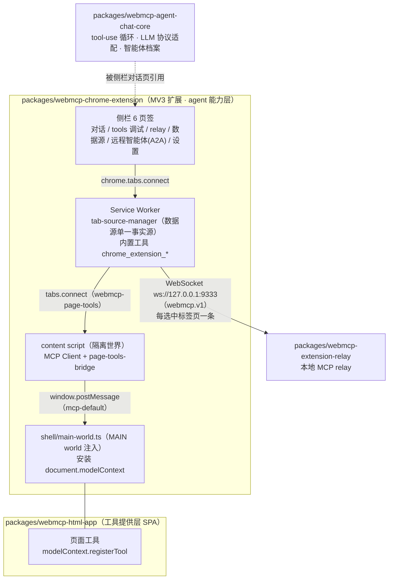
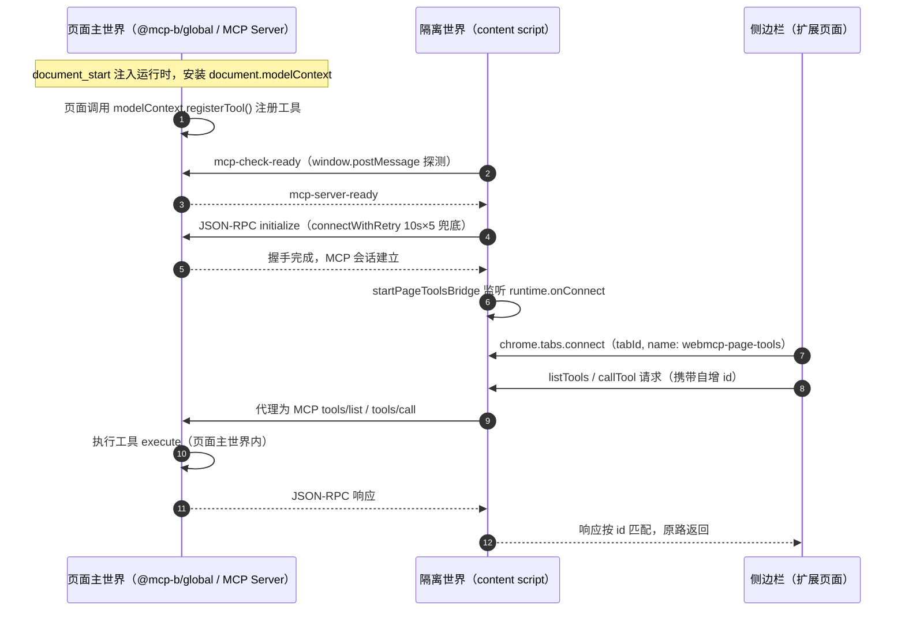
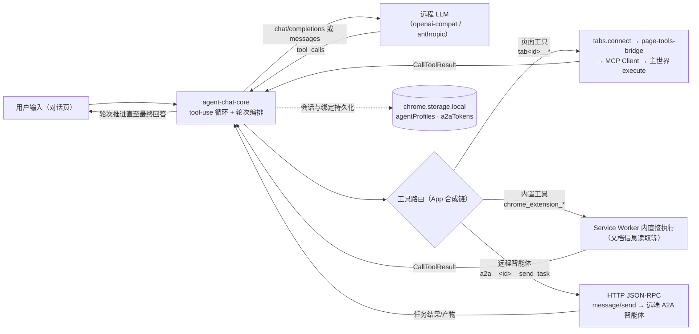
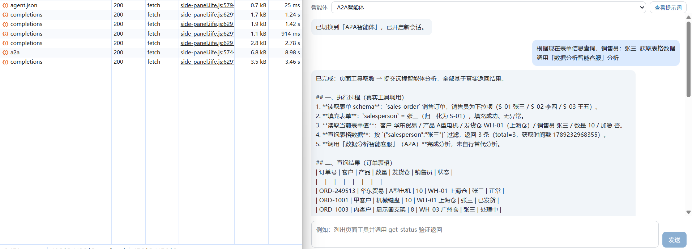
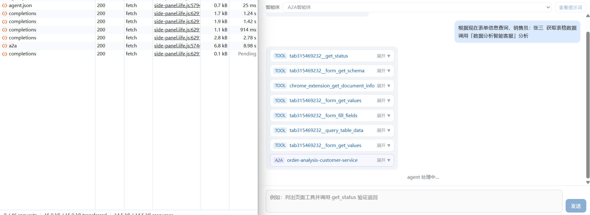
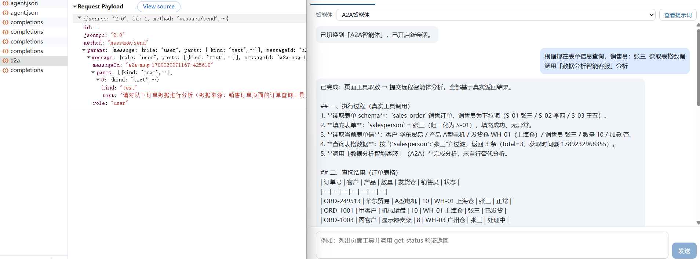
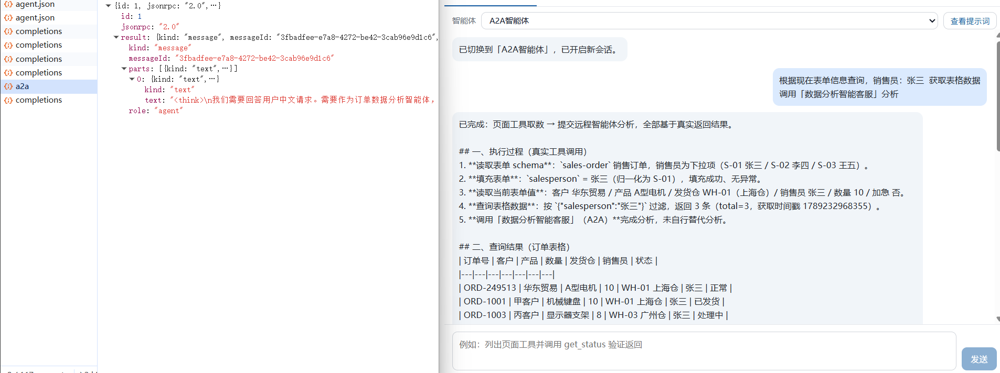

# webmcp-example

基于 [WebMCP](https://webmachinelearning.github.io/webmcp/)（Web Model Context Protocol，W3C 草案）的示例工程。

通过 `pnpm` 构建 TypeScript 单一仓库（monorepo），包含四个核心模块：

| 模块 | 类型 | 角色 |
| ---- | ---- | ---- |
| `packages/webmcp-chrome-extension` | Chromium 扩展（MV3） | **agent 能力层**：向页面注入 WebMCP 运行时，从隔离世界发现、校验、执行页面工具；内置侧栏 agent 对话（页面工具 + 内置工具 + A2A 远程智能体） |
| `packages/webmcp-html-app` | Web 应用（SPA） | **工具提供层**：通过 `document.modelContext.registerTool()` 暴露结构化工具（表单填充、表格查询等演示工具） |
| `packages/webmcp-agent-chat-core` | TypeScript 共享库 | **对话领域纯逻辑**：tool-use 循环、LLM 协议适配（openai-compat / anthropic）、轮次编排控制器、内置智能体档案；零 UI、零浏览器 API |
| `packages/webmcp-extension-relay` | Node.js 本地服务 | **本地 MCP relay**：经 localhost WebSocket（`ws://127.0.0.1:9333`，`webmcp.v1` 子协议）把浏览器 WebMCP 工具桥接给本地 MCP 客户端，浏览器源即本扩展 |

## 快速开始

```bash
pnpm install        # 安装依赖
pnpm build          # 构建所有 package
pnpm dev            # 并行开发模式（各包 watch）
pnpm typecheck      # 全量类型检查
pnpm lint           # ESLint 检查
pnpm test           # 单元测试（vitest）

# 构建单个 package
pnpm --filter webmcp-chrome-extension build
pnpm --filter @mcp-b/example-vanilla build
```

扩展构建产物在 `packages/webmcp-chrome-extension/dist/`，于 `chrome://extensions` 以「加载已解压的扩展程序」载入即可。

## 文档

- [docs/ 技术文档](docs/README.md)：架构、快速开始、设计文档与概念参考。
- [docs/architecture.md](docs/architecture.md)：整体架构设计。
- [rules/ 工程规则](rules/README.md)：语言与项目规范。
- [AGENT.md](AGENT.md)：AI 代理工作指引。
- [packages/webmcp-chrome-extension/docs/](packages/webmcp-chrome-extension/docs/)：A2A 端到端案例截图（见下文「案例」）。

## 架构图

### Monorepo 模块架构



### 浏览器内：页面主世界与隔离世界


Chrome 扩展的 content script 运行在与网页**互相隔离的 JavaScript 环境**中。同一个标签页里存在两个世界，它们**共享同一个 DOM，但各自拥有独立的 JavaScript 全局作用域**：

| 维度 | 页面主世界（MAIN world） | 隔离世界（Isolated world，默认） |
| ---- | ---- | ---- |
| 是什么 | 网页自身的 JS 环境（页面 `<script>`、框架代码） | Chrome 为 content script 创建的独立 JS 环境 |
| 全局对象 | 页面原生 `window` / `document` | 独立副本（隔离的 JS 堆） |
| DOM | 共享 | 共享（改 DOM 双方可见） |
| 页面 JS 变量/函数 | 直接访问 | **不可见**（不能直接读写） |
| `chrome.*` 特权 API | **不可用** | 可用（storage、runtime 消息等受限子集） |
| 互相通信方式 | 仅 `window.postMessage` / DOM 事件等序列化通道 | 同左 |
| 注入方式 | manifest `content_scripts` 声明 `"world": "MAIN"` | content script 默认世界 |

这样设计出于安全考虑：页面脚本不可信，若与扩展共享 JS 环境，页面可篡改扩展逻辑；而特权 API 也绝不能暴露给页面。代价是扩展无法直接操作页面的 JS 状态，必须经消息通道中转。

### 本项目的落点

- **页面主世界**：`packages/webmcp-chrome-extension/shell/main-world.ts` 在 `document_start` 以 MAIN world 注入 `@mcp-b/global`，安装 `document.modelContext`（优先原生 WebMCP，缺失时降级 polyfill）；`webmcp-html-app` 业务代码在此调用 `modelContext.registerTool()` 注册工具，工具的 `execute` 闭包也在主世界执行（可直接访问页面 DOM 与业务状态），并扮演 MCP Server（监听 channel `mcp-default` 的 window message）。
- **隔离世界**：`packages/webmcp-chrome-extension/core/content-script.ts` 建立 MCP Client（`TabClientTransport` + JSON-RPC 会话），`core/page-tools-bridge.ts` 把已连接的 Client 通过 `chrome.runtime` 长连接暴露给扩展其他上下文。此世界可用特权 API，但看不到页面 JS。
- **扩展页面**：侧边栏 `main-extension/side-panel/panel-client.ts` 经 `chrome.tabs.connect(tabId, { name: 'webmcp-page-tools' })` 连接到**选中标签页**的桥接（选中状态由 Service Worker 的 `tab-source-manager` 统一管理，是数据源的单一事实源），发送轻量 `listTools` / `callTool` 请求。

两条通道的分工（注意：扩展页面 → content script 必须用 `tabs.connect`，官方文档明确 `runtime.connect` 只在扩展进程上下文间投递，到不了 content script）：

| 通道 | 连接的上下文 | 承载协议 |
| ---- | ---- | ---- |
| ① `window.postMessage`（channel `mcp-default`） | 隔离世界 ↔ 页面主世界 | 标准 MCP JSON-RPC（`tools/list`、`tools/call`） |
| ② `chrome.tabs.connect(tabId)`（port name `webmcp-page-tools`） | 扩展页面（侧栏） ↔ 选中标签页的 content script | 扩展内部轻量请求-响应协议（工具 schema 原样透传） |
| ③ WebSocket（`webmcp.v1` 子协议） | Service Worker（`core/relay-source-client.ts`） ↔ 本地 relay | relay 源模型：hello / tools 上报、工具调用下发（每选中标签页一条连接） |

## 交互流程图：连接建立时序




1. 扩展在 `document_start` 注入运行时，安装 `document.modelContext`；
2. 页面调用 `modelContext.registerTool()` 注册工具；
3. content script 的 `TabClientTransport` 经 `window.postMessage` 发送 `mcp-check-ready` 探测；
4. polyfill 应答 `mcp-server-ready`，完成 JSON-RPC `initialize` 握手（`TabClientTransport` 探测为一次性，故 `connectWithRetry` 以 10s 超时 × 5 次兜底）；
5. 握手成功即注册 `startPageToolsBridge`，监听 `runtime.onConnect`（把侧栏可连接窗口最早化）；
6. 侧栏 `chrome.tabs.connect(tabId)` 接入选中标签页，工具调用沿「侧栏 → Port → 桥接 → MCP Client → postMessage → polyfill → `execute`」原路返回。

## 核心功能数据流程图：侧栏 agent 对话的工具调用

侧栏对话页一次用户请求的数据流。智能体（默认 `tool-debug`，可切换 `multi-turn-loop` / `a2a-analyst`）由 `webmcp-agent-chat-core` 驱动 tool-use 循环，可编排三类工具：



要点：

- **页面工具统一命名**：侧栏合成的页面工具一律加 `tab<id>__` 前缀（多标签页不冲突），调用时经路由表投递原始名。
- **内置工具**：`chrome_extension_*` 在扩展进程内直接执行（如页面文档信息读取），结果统一为 MCP `CallToolResult`。
- **A2A 远程智能体**：在「远程智能体」页签按智能体分别管理绑定（卡片地址 / 端点覆盖 / Bearer Token），对话中以 `a2a__<id>__send_task` 暴露；删除等危险操作经两步确认。
- **数据源选择**：SW 的 `tab-source-manager` 是单一事实源（存储键 `relayTabSelection`），侧栏重开时重置为活动页签；未选中的页签不建立 SW → relay WebSocket。

## 侧栏功能页签

| 页签 | 文件（`main-extension/side-panel/pages/`） | 职责 |
| ---- | ---- | ---- |
| agent 对话 | `ChatPage.ts` | 内置智能体对话、工具调用轨迹展示（TOOL / A2A 徽标） |
| tools 调试 | `DebugPage.ts` | 工具列表浏览与单工具手动调用 |
| relay 调用 | `RelayPage.ts` | 本地 relay 连接状态与调用观测 |
| 数据源 | `DataSourcePage.ts` | 选择向 relay / 侧栏供数的标签页（选中态置顶展示） |
| 远程智能体 | `A2aPage.ts` | A2A 绑定管理：列表 / 新增 / 编辑（连通测试、两步确认删除） |
| 设置 | `SettingsPage.ts` | LLM 连接配置（只读摘要 + 编辑表单）、日志导出/清空 |

## 案例：A2A 智能体端到端演示

截图位于 [packages/webmcp-chrome-extension/docs/](packages/webmcp-chrome-extension/docs/)，演示「页面工具取数 → A2A 委托远端智能体分析 → 结果回流」的完整闭环。

**1. 下发复合任务**（[agent-a2a-prompt.png](packages/webmcp-chrome-extension/docs/agent-a2a-prompt.png)）



用户对「A2A智能体」发出请求：查询订单表格（页面工具），并将表格数据委托给「数据分析智能体」（远端 A2A 智能体）分析。

**2. 工具编排轨迹**（[agent-a2a-tools.png](packages/webmcp-chrome-extension/docs/agent-a2a-tools.png)）



智能体依次调用 `tab<id>__get_status`、`tab<id>__form_get_schema`、`chrome_extension_get_document_info`、`tab<id>__form_get_values`、`tab<id>__form_fill_fields`、`tab<id>__query_table_data` 完成页面取数与回填，最后以 **A2A 徽标**调用远端智能体 `order-analysis-customer-service`。

**3. A2A 协议请求**（[agent-a2a-send.png](packages/webmcp-chrome-extension/docs/agent-a2a-send.png)）



网络面板中的 JSON-RPC `message/send` 请求载荷：`messageId` 携带 `a2a-msg-` 前缀，`parts` 为 text part 承载分析委托指令。

**4. 协议响应与最终结果**（[agent-a2a-result.png](packages/webmcp-chrome-extension/docs/agent-a2a-result.png)）



远端智能体以 `role: agent` 消息应答；对话页汇总展示真实工具回填的订单分析表（发货仓、销售员、状态均来自页面实际数据，非编造）。

## 上游参考（git 子模块，只读）

- `git-source/webmcp-tools`：GoogleChromeLabs 的 WebMCP 工具集合。
- `git-source/npm-packages`：WebMCP-org 的 `@mcp-b/*` npm 包与文档。

## 许可

MIT
