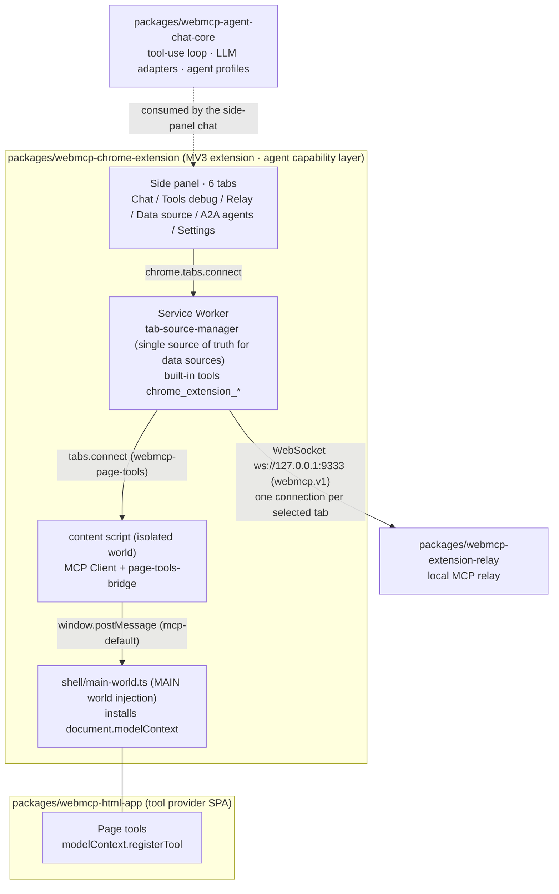
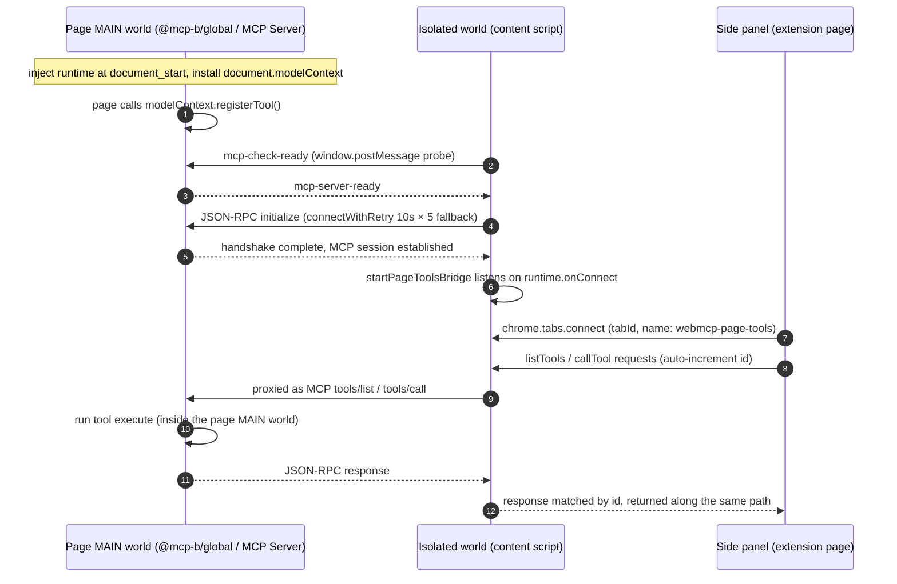
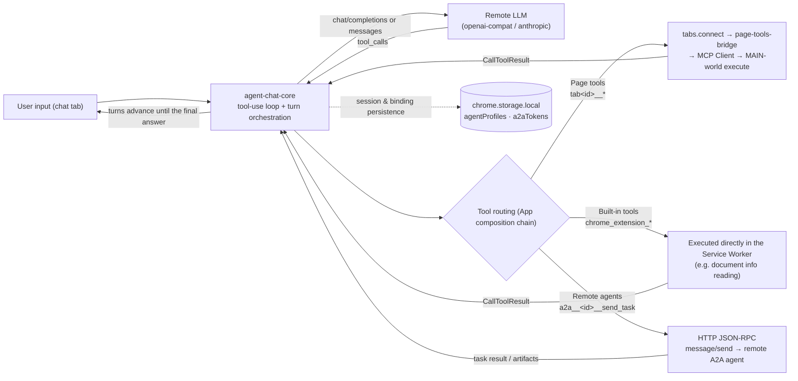

# webmcp-example

An example project built on [WebMCP](https://webmachinelearning.github.io/webmcp/) (Web Model Context Protocol, W3C draft).

A TypeScript monorepo managed by `pnpm`, consisting of four core modules:

| Module | Type | Role |
| ---- | ---- | ---- |
| `packages/webmcp-chrome-extension` | Chromium extension (MV3) | **Agent capability layer**: injects the WebMCP runtime into pages, discovers/validates/executes page-exposed tools from the isolated world; ships a side-panel agent chat (page tools + built-in tools + A2A remote agents) |
| `packages/webmcp-html-app` | Web app (SPA) | **Tool provider layer**: exposes structured tools via `document.modelContext.registerTool()` (form filling, table query, etc.) |
| `packages/webmcp-agent-chat-core` | TypeScript library | **Conversation domain logic**: tool-use loop, LLM protocol adapters (openai-compat / anthropic), turn orchestration, built-in agent profiles; zero UI, zero browser APIs |
| `packages/webmcp-extension-relay` | Node.js local service | **Local MCP relay**: bridges browser WebMCP tools to local MCP clients over a localhost WebSocket (`ws://127.0.0.1:9333`, `webmcp.v1` subprotocol); the browser source is this extension |

> 中文版文档见 [README-zh.md](README-zh.md)。

## Quick Start

```bash
pnpm install        # install dependencies
pnpm build          # build all packages
pnpm dev            # parallel dev mode (watch all packages)
pnpm typecheck      # full type check
pnpm lint           # ESLint
pnpm test           # unit tests (vitest)

# build a single package
pnpm --filter webmcp-chrome-extension build
pnpm --filter @mcp-b/example-vanilla build
```

The extension build output lands in `packages/webmcp-chrome-extension/dist/` — load it via "Load unpacked" on `chrome://extensions`.

## Documentation

- [docs/ technical docs](docs/README.md): architecture, quick start, design docs and concept reference.
- [docs/architecture.md](docs/architecture.md): overall architecture design.
- [rules/ engineering rules](rules/README.md): language and project conventions.
- [AGENT.md](AGENT.md): AI agent working guide.
- [packages/webmcp-chrome-extension/docs/](packages/webmcp-chrome-extension/docs/): A2A end-to-end case screenshots (see "Case Study" below).

## Architecture

### Monorepo Module Architecture



### Inside the Browser: MAIN World vs Isolated World

 <!-- labels in Chinese; English equivalent in the Mermaid source above/below -->

Chrome extension content scripts run in a JavaScript environment **isolated from the web page**. Each tab hosts two worlds that **share the same DOM but keep separate JavaScript global scopes**:

| Dimension | Page MAIN world | Isolated world (default) |
| ---- | ---- | ---- |
| What it is | The page's own JS environment (page `<script>`, framework code) | A separate JS environment Chrome creates for content scripts |
| Global object | The page's native `window` / `document` | An independent copy (isolated JS heap) |
| DOM | Shared | Shared (DOM changes are visible to both) |
| Page JS variables/functions | Direct access | **Invisible** (no direct read/write) |
| `chrome.*` privileged APIs | **Unavailable** | Available (limited subset: storage, runtime messaging, etc.) |
| Communication | Only serialized channels: `window.postMessage` / DOM events | Same |
| Injection | manifest `content_scripts` with `"world": "MAIN"` | Default world for content scripts |

This is a security boundary: page scripts are untrusted — sharing a JS realm with the extension would let the page tamper with extension logic, and privileged APIs must never leak to the page. The cost: the extension cannot touch the page's JS state directly and must go through message channels.

### Where This Project Fits

- **Page MAIN world**: `packages/webmcp-chrome-extension/shell/main-world.ts` injects `@mcp-b/global` at `document_start` in the MAIN world and installs `document.modelContext` (native WebMCP when available, polyfill fallback otherwise); the `webmcp-html-app` business code calls `modelContext.registerTool()` here, tool `execute` closures run in this world (direct access to page DOM and business state), and it acts as the MCP Server (listening for window messages on channel `mcp-default`).
- **Isolated world**: `packages/webmcp-chrome-extension/core/content-script.ts` sets up the MCP Client (`TabClientTransport` + JSON-RPC session); `core/page-tools-bridge.ts` exposes the connected Client to other extension contexts over a long-lived `chrome.runtime` connection. This world can use privileged APIs but cannot see page JS.
- **Extension pages**: the side panel `main-extension/side-panel/panel-client.ts` connects via `chrome.tabs.connect(tabId, { name: 'webmcp-page-tools' })` to the bridge of the **selected tab** (selection is managed centrally by the Service Worker's `tab-source-manager`, the single source of truth for data sources), sending lightweight `listTools` / `callTool` requests.

Division of labor across the channels (note: extension page → content script must use `tabs.connect`; per the official docs, `runtime.connect` is only delivered among extension process contexts and never reaches content scripts):

| Channel | Contexts connected | Protocol |
| ---- | ---- | ---- |
| ① `window.postMessage` (channel `mcp-default`) | isolated world ↔ page MAIN world | standard MCP JSON-RPC (`tools/list`, `tools/call`) |
| ② `chrome.tabs.connect(tabId)` (port name `webmcp-page-tools`) | extension page (side panel) ↔ selected tab's content script | lightweight extension-internal request-response protocol (tool schemas passed through as-is) |
| ③ WebSocket (`webmcp.v1` subprotocol) | Service Worker (`core/relay-source-client.ts`) ↔ local relay | relay source model: hello/tools reporting, tool-call dispatch (one connection per selected tab) |

## Interaction Flow: Connection Establishment Sequence

 <!-- labels in Chinese; English equivalent in the Mermaid source below -->



1. The extension injects the runtime at `document_start` and installs `document.modelContext`;
2. The page registers tools via `modelContext.registerTool()`;
3. The content script's `TabClientTransport` sends an `mcp-check-ready` probe over `window.postMessage`;
4. The polyfill answers `mcp-server-ready` and the JSON-RPC `initialize` handshake completes (`TabClientTransport` probes only once, so `connectWithRetry` backs it off with 10s timeout × 5 attempts);
5. On success it registers `startPageToolsBridge`, listening on `runtime.onConnect` (opening the side-panel connection window as early as possible);
6. The side panel `chrome.tabs.connect(tabId)` connects to the selected tab; tool calls travel "side panel → Port → bridge → MCP Client → postMessage → polyfill → `execute`" and responses return along the same path.

## Core Data Flow: Side-Panel Agent Chat Tool Calls

Data flow of a single user request in the side-panel chat. The agent (default `tool-debug`; switchable to `multi-turn-loop` / `a2a-analyst`) is driven by `webmcp-agent-chat-core`'s tool-use loop and can orchestrate three kinds of tools:



Key points:

- **Unified page-tool naming**: all page tools synthesized in the side panel get a `tab<id>__` prefix (no collisions across tabs); calls are delivered under the original name via the routing table.
- **Built-in tools**: `chrome_extension_*` execute directly inside the extension process (e.g. page document info reading); results are uniformly MCP `CallToolResult`.
- **A2A remote agents**: bindings are managed per agent in the "A2A agents" tab (card URL / endpoint override / Bearer token) and exposed in chat as `a2a__<id>__send_task`; destructive actions (e.g. delete) use an inline two-step confirmation.
- **Data-source selection**: the SW's `tab-source-manager` is the single source of truth (storage key `relayTabSelection`), reset to the active tab when the side panel reopens; no SW → relay WebSocket is opened for unselected tabs.

## Side-Panel Tabs

| Tab | File (`main-extension/side-panel/pages/`) | Responsibility |
| ---- | ---- | ---- |
| Agent chat | `ChatPage.ts` | Built-in agent chat, tool-call trace display (TOOL / A2A badges) |
| Tools debug | `DebugPage.ts` | Browse tool lists and invoke a single tool manually |
| Relay | `RelayPage.ts` | Local relay connection status and call observability |
| Data source | `DataSourcePage.ts` | Pick the tab feeding the relay / side panel (selected item pinned on top) |
| A2A agents | `A2aPage.ts` | A2A binding management: list / add / edit (connection test, two-step delete) |
| Settings | `SettingsPage.ts` | LLM connection config (read-only summary + edit form), log export/clear |

## Case Study: A2A Agent End-to-End Demo

Screenshots live in [packages/webmcp-chrome-extension/docs/](packages/webmcp-chrome-extension/docs/) (labels in the UI are in Chinese), demonstrating the full loop of "page tools fetch data → A2A delegates to a remote agent → results flow back".

**1. Composite task** ([agent-a2a-prompt.png](packages/webmcp-chrome-extension/docs/agent-a2a-prompt.png))


The user asks the "A2A agent" to query an order table (page tools) and delegate the table data to a "data-analysis agent" (remote A2A agent) for analysis.

**2. Tool orchestration trace** ([agent-a2a-tools.png](packages/webmcp-chrome-extension/docs/agent-a2a-tools.png))


The agent calls `tab<id>__get_status`, `tab<id>__form_get_schema`, `chrome_extension_get_document_info`, `tab<id>__form_get_values`, `tab<id>__form_fill_fields`, `tab<id>__query_table_data` to fetch and backfill page data, then invokes the remote agent `order-analysis-customer-service` under the **A2A badge**.

**3. A2A protocol request** ([agent-a2a-send.png](packages/webmcp-chrome-extension/docs/agent-a2a-send.png))


The JSON-RPC `message/send` request payload in the network panel: `messageId` carries the `a2a-msg-` prefix, and `parts` carries the delegation instructions as a text part.

**4. Protocol response and final result** ([agent-a2a-result.png](packages/webmcp-chrome-extension/docs/agent-a2a-result.png))


The remote agent replies with a `role: agent` message; the chat tab summarizes the order-analysis table with data actually backfilled by the tools (warehouse, salesperson and status all come from real page data, not fabricated).

## Upstream References (git submodules, read-only)

- `git-source/webmcp-tools`: WebMCP tool collection by GoogleChromeLabs.
- `git-source/npm-packages`: `@mcp-b/*` npm packages and docs by WebMCP-org.

## License

MIT
