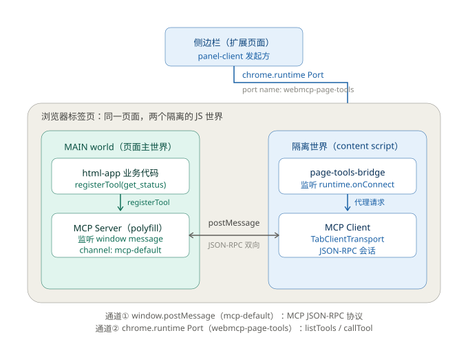
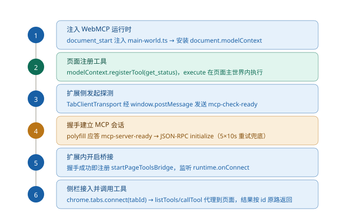
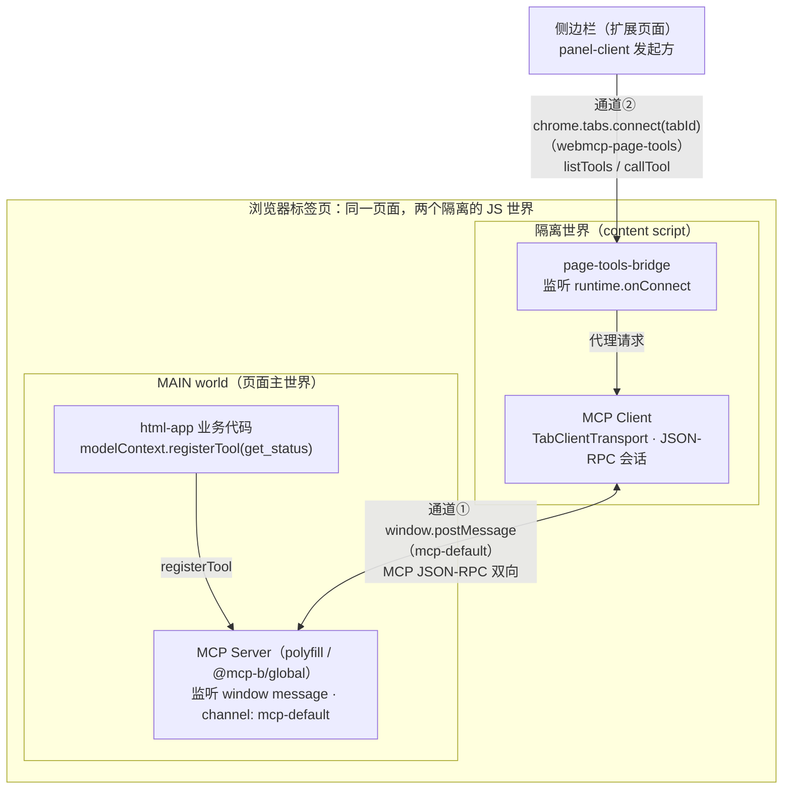
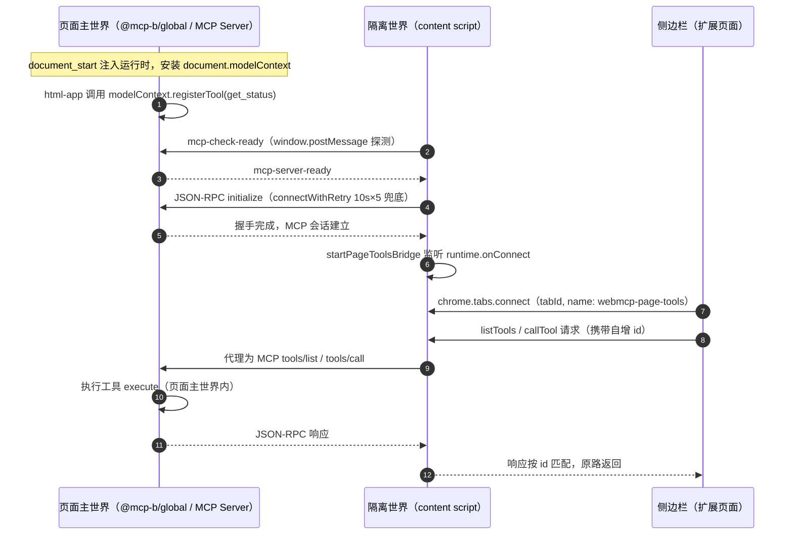

# webmcp-example

基于 [WebMCP](https://webmachinelearning.github.io/webmcp/)（Web Model Context Protocol，W3C 草案）的示例工程。

通过 `pnpm` 构建 TypeScript 单一仓库（monorepo），包含两个核心模块：

| 模块 | 类型 | 角色 |
| ---- | ---- | ---- |
| `packages/chrome-extension` | 浏览器插件端 | **agent 能力层**：发现、校验、执行、验证页面暴露的 WebMCP tools |
| `packages/html-app` | Web 应用（SPA） | **工具提供层**：通过 `document.modelContext.registerTool()` 暴露结构化工具 |

## 快速开始

```bash
pnpm install        # 安装依赖
pnpm build          # 构建所有 package
pnpm --filter <pkg> build   # 构建单个 package（chrome-extension / html-app）
```

## 文档

- [docs/ 技术文档](docs/README.md)：架构、快速开始、WebMCP 概念参考。
- [rules/ 工程规则](rules/README.md)：语言与项目规范。
- [AGENT.md](AGENT.md)：AI 代理工作指引。

## 核心概念：页面主世界与隔离世界

Chrome 扩展的 content script 运行在与网页**互相隔离的 JavaScript 环境**中。同一个标签页里存在两个世界，它们**共享同一个 DOM，但各自拥有独立的 JavaScript 全局作用域**：

| 维度 | 页面主世界（MAIN world） | 隔离世界（Isolated world，默认） |
| ---- | ---- | ---- |
| 是什么 | 网页自身的 JS 环境（页面 `<script>`、框架代码） | Chrome 为 content script 创建的独立 JS 环境 |
| 全局对象 | 页面原生 `window` / `document` | 独立副本（隔离的 JS 堆） |
| DOM | 共享 | 共享（改 DOM 双方可见） |
| 页面 JS 变量/函数 | 直接访问 | **不可见**（不能直接读写） |
| `chrome.*` 特权 API | **不可用** | 可用（storage、runtime 消息等受限子集） |
| 互相通信方式 | 仅 `window.postMessage` / DOM 事件等序列化通道 | 同左 |
| 注入方式 | manifest `content_scripts` 声明 `"world": "MAIN"` | content script 默认世界 |

这样设计出于安全考虑：页面脚本不可信，若与扩展共享 JS 环境，页面可篡改扩展逻辑；而特权 API 也绝不能暴露给页面。代价是扩展无法直接操作页面的 JS 状态，必须经消息通道中转。

### 本项目的落点



- **页面主世界**：`shell/main-world.ts` 在 `document_start` 以 MAIN world 注入 `@mcp-b/global`，安装 `document.modelContext`（优先原生 WebMCP，缺失时降级 polyfill）；`html-app` 业务代码在此调用 `modelContext.registerTool()` 注册工具，工具的 `execute` 闭包也在主世界执行（可直接访问页面 DOM 与业务状态），并扮演 MCP Server（监听 channel `mcp-default` 的 window message）。
- **隔离世界**：`core/content-script.ts` 建立 MCP Client（`TabClientTransport` + JSON-RPC 会话），`core/page-tools-bridge.ts` 把已连接的 Client 通过 `chrome.runtime` 长连接暴露给扩展其他上下文。此世界可用特权 API，但看不到页面 JS。
- **扩展页面**：侧边栏 `panel-client.ts` 经 `chrome.tabs.connect(tabId, { name: 'webmcp-page-tools' })` 连接到**活动标签页**的桥接，发送轻量 `listTools` / `callTool` 请求，并在切换标签页时自动跟随重连。

两条通道的分工（注意：扩展页面 → content script 必须用 `tabs.connect`，官方文档明确 `runtime.connect` 只在扩展进程上下文间投递，到不了 content script）：

| 通道 | 连接的上下文 | 承载协议 |
| ---- | ---- | ---- |
| ① `window.postMessage`（channel `mcp-default`） | 隔离世界 ↔ 页面主世界 | 标准 MCP JSON-RPC（`tools/list`、`tools/call`） |
| ② `chrome.tabs.connect(tabId)`（port name `webmcp-page-tools`） | 扩展页面（侧栏） ↔ 活动标签页的 content script | 扩展内部轻量请求-响应协议（工具 schema 原样透传） |

### 连接建立时序



1. 扩展在 `document_start` 注入运行时，安装 `document.modelContext`；
2. 页面调用 `modelContext.registerTool(get_status)` 注册工具；
3. content script 的 `TabClientTransport` 经 `window.postMessage` 发送 `mcp-check-ready` 探测；
4. polyfill 应答 `mcp-server-ready`，完成 JSON-RPC `initialize` 握手（`TabClientTransport` 探测为一次性，故 `connectWithRetry` 以 10s 超时 × 5 次兜底）；
5. 握手成功即注册 `startPageToolsBridge`，监听 `runtime.onConnect`（把侧栏可连接窗口最早化）；
6. 侧栏 `chrome.tabs.connect(tabId)` 接入活动标签页，工具调用沿「侧栏 → Port → 桥接 → MCP Client → postMessage → polyfill → `execute`」原路返回。

### Mermaid 源图（供无法读取图片的大模型消费）

与上方两张 SVG 图等价，以下为文本版：

架构与双通道：



连接建立时序：



## 上游参考（git 子模块，只读）

- `git-source/webmcp-tools`：GoogleChromeLabs 的 WebMCP 工具集合。
- `git-source/npm-packages`：WebMCP-org 的 `@mcp-b/*` npm 包与文档。

## 许可

MIT