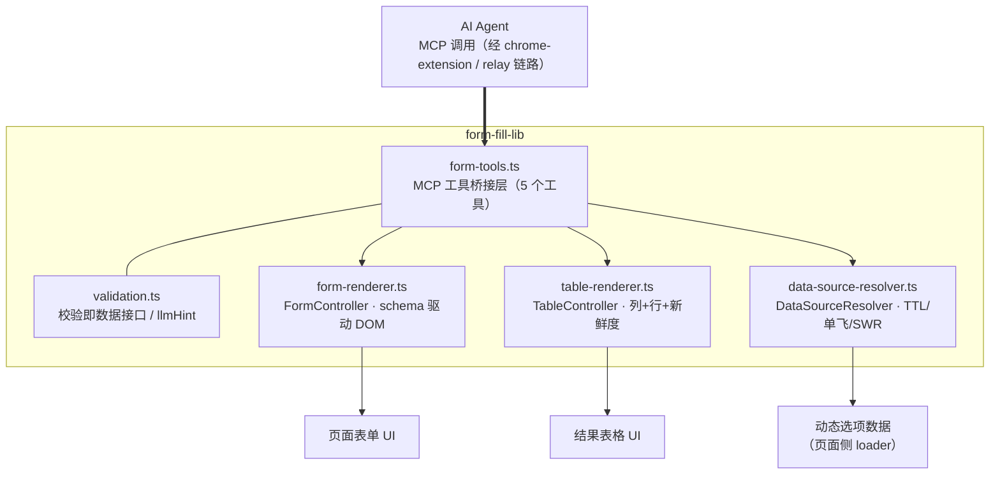
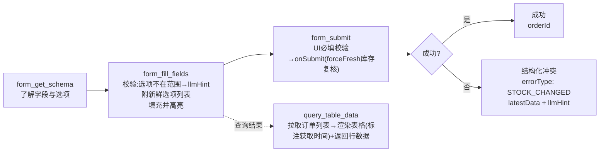

# webmcp-form-fill-lib · 页面侧表单填充与查询结果表格可复用库设计

> 状态：✅ 方案已确认并实现（2026-09-06）
> 实现：`packages/webmcp-html-app/src/form-fill-lib/`（types / data-source-resolver / validation /
> form-renderer / table-renderer / form-tools / index）+ `src/demo/order-form.ts` 接线
> 验证：tsc 0 错 · eslint 0 问题 · vitest 31 passed
> 范围：`packages/webmcp-html-app/src/form-fill-lib`（新增）+ `src/main.ts`（demo 接线）
> 上游依据：[docs/webmcp-form-fill.md](./webmcp-form-fill.md)（时效性数据校验策略：短TTL + 合并请求 + 执行时复核）

## 1. 背景与目标

`docs/webmcp-form-fill.md` 给出了 ERP 场景下时效性动态数据的校验策略，三条铁律：

1. **缓存只服务读和预校验，不作为写操作的依据**——写操作前必须 forceFresh，后端做最终裁决；
2. **校验失败的错误信息就是最好的"数据接口"**——把新鲜合法选项列表直接喂给 AI，一次修正到位；
3. **校验通过 ≠ 执行成功**——用结构化冲突响应（附最新数据）让 AI 能自愈。

本设计将该策略**移植到 WebMCP 页面侧**：AI 通过页面注册的 MCP 工具完成「读 schema → 填表单 → 提交复核」闭环，页面同时提供**可复用的表单渲染器**与**查询结果表格渲染器**，通用能力收敛到 `src/form-fill-lib`。

| 目标 | 说明 |
|------|------|
| MCP 驱动表单填充 | AI 调用 `form_get_schema` / `form_fill_fields` / `form_get_values` / `form_submit` 完成填充与提交 |
| 可复用表单组件 | schema 驱动渲染（vanilla DOM，零框架），支持静态/动态下拉选项 |
| 可复用结果表格 | 列定义 + 行数据渲染，带数据新鲜度标注（呼应设计文档第五节） |
| 时效性数据源 | `DataSourceResolver` 页面侧适配版：TTL / 单飞 / SWR / forceFresh / markStale |
| 通用能力收敛 | 全部沉淀在 `form-fill-lib`，`main.ts` 只做 demo 业务接线 |

## 2. 现状分析（已验证）

| 项 | 现状 | 影响 |
|----|------|------|
| `webmcp-html-app` | vanilla TS + Vite SPA，`document.modelContext.registerTool()` 注册工具 | 无框架依赖，渲染器走原生 DOM |
| 已有工具 | 仅 `get_status` 示例（`src/tools/get-status.ts`） | 新工具组独立放 `form-fill-lib/form-tools.ts` |
| `src/form-fill-lib` | 空目录（已预留） | 本设计的落点 |
| tsconfig | `strict` + `erasableSyntaxOnly` + `verbatimModuleSyntax` | 禁用 enum/namespace；类型导入必须 `import type` |
| 测试 | vitest，node 环境（无 happy-dom/jsdom） | DOM 渲染器不做 DOM 级测试，核心逻辑抽纯函数测试 |

## 3. 总体架构



数据流（AI 一次完整任务）：



## 4. form-fill-lib 模块划分

| 文件 | 职责 | 可测性 |
|------|------|--------|
| `types.ts` | FormSchema / FieldSchema / DataSourceOption / FillOutcome / SubmitOutcome / ToolTextResult 等类型 | 类型层 |
| `data-source-resolver.ts` | 时效性数据源解析器（页面侧适配版）+ 注册表 + `setupCacheInvalidation` | 纯逻辑，全量单测 |
| `validation.ts` | 未知字段 / 必填缺失 / 选项合法性校验 + `llmHint` 构造 | 纯函数，全量单测 |
| `form-renderer.ts` | schema 驱动表单渲染，返回 `FormController` | DOM 层（不测） |
| `table-renderer.ts` | 结果表格渲染，返回 `TableController` | DOM 层（不测） |
| `form-tools.ts` | 构造 5 个 MCP 工具，编排校验/填充/提交流程 | 依赖 FormController stub，全量单测 |
| `index.ts` | 统一导出 | — |

## 5. MCP 工具设计（registerTool 输入）

工具命名不带 `webmcp_` 前缀（区别于 relay 静态管理工具组，属页面业务工具）。所有结果统一 `{ content: [{ type: 'text', text: <JSON stringify> }] }`。

### 5.1 form_get_schema

```jsonc
{
  "name": "form_get_schema",
  "description": "获取页面表单的字段定义、类型、必填项与当前可选选项（含数据获取时间）",
  "inputSchema": { "type": "object", "properties": {} },
  // 返回：{ formId, title, fields: [{ name, label, type, required, options: [{value,label}] , dataSource, freshnessSec }] }
}
```

### 5.2 form_fill_fields

```jsonc
{
  "name": "form_fill_fields",
  "description": "批量填充表单字段。select 字段值非法时返回合法选项列表(含数据新鲜度)，AI 可据此一次修正",
  "inputSchema": {
    "type": "object",
    "properties": {
      "values": { "type": "object", "description": "字段名→值映射，字段定义先经 form_get_schema 获取" }
    },
    "required": ["values"]
  },
  // 校验链（对齐设计文档"错误信息即数据接口"）：
  //  未知字段      → issue UNKNOWN_FIELD + llmHint(可用字段列表)
  //  select 非法值 → issue INVALID_OPTION + llmHint(合法选项截断15个 + 获取于N秒前)
  //  select 传 label → 自动归一化为 value
  //  number 非数字 → issue INVALID_VALUE
  // 返回：{ success, filled: string[], issues: [{ field, errorType, reason, llmHint }] }
}
```

### 5.3 form_get_values / form_submit

```jsonc
// form_get_values：读取当前表单值，供 AI 确认填充结果
{ "name": "form_get_values", "inputSchema": { "type": "object", "properties": {} } }

// form_submit：提交前 UI 必填校验 → onSubmit 处理器（内含 forceFresh 复核）
// 返回成功：{ success: true, data: { orderId, ... } }
// 返回复核冲突（铁律3）：{ success: false, errorType: "STOCK_CHANGED",
//                          reason: "...当前可用库存8，不足20", latestData: [...],
//                          llmHint: "基于 latestData 重新决策后重试" }
// 必填缺失：{ success: false, errorType: "VALIDATION", reason: "缺少必填字段: x, y",
//             llmHint: "可调用 form_fill_fields 填充后重试" }
```

### 5.4 query_table_data

```jsonc
{
  "name": "query_table_data",
  "description": "查询订单数据，渲染到页面结果表格并返回结构化行数据",
  "inputSchema": { "type": "object", "properties": {} },
  // 返回：{ success, total, fetchedAt, rows: [...] }  页面表格同步更新
}
```

## 6. 关键设计点

### 6.1 DataSourceResolver：服务端策略 → 页面侧适配

| 设计文档（服务端） | 本实现（页面侧） | 原因 |
|--------------------|------------------|------|
| 缓存按 `session.userId` 隔离 | 缓存按 **params 稳定序列化** 隔离（无参 = 单槽） | 页面无多用户概念；带参数据源（如按商品查库存）天然需要参数维度隔离 |
| `registerDataSource` 全局注册表 | 保留同名 API + `createDataSource` 独立工厂 | demo 用注册表，业务可独立实例化 |
| `markStale()` 文档未给出实现 | 实现：全量标记 `stale`，下次 `get` 走**同步**强制刷新（单飞） | visibilitychange 回焦场景，同步拉新比 SWR 更符合"复核"精神；与文档"下次访问刷新"语义一致 |
| `cleanup(maxIdle)` 定时清理 | 实现：按 `lastAccessAt` 清理超时缓存槽，防内存泄漏 | 补齐文档第六节⑤ |
| SWR 30~60s 返回旧数据 | 保留；但 `stale` 标记或 `freshRequired` 数据源跳过 SWR | 铁律 1 |

TTL 分级策略原样保留（弱时效 60s / 中时效 30s / 强时效 5s + `freshRequired`）。

### 6.2 校验失败即喂选项（铁律 2）

`form_fill_fields` 对 select 字段校验时，选项来自 `DataSourceResolver.get()`（走 TTL/单飞），失败时 `llmHint` 附**截断 15 个**的 `value(label)` 列表 + 数据获取时间。AI 无需二次发现接口即可自愈。

### 6.3 执行时复核（铁律 3）

`form_submit` 不直接写数据，而是调用 `FormController.requestSubmit()` → 触发 demo 注册的 `onSubmit` 处理器：对 `freshRequired` 数据源 `get(params, { forceFresh: true })` 复核，不足时返回 `errorType: 'STOCK_CHANGED'` + `latestData`。后端真实场景中由乐观锁兜底（本 demo 为内存 mock）。

### 6.4 填充视觉反馈

AI 填充的字段加 `.ff-agent-filled` 高亮描边，用户 focus/输入后移除——让人能区分「AI 填的」与「自己填的」。

## 7. Demo 场景（main.ts 接线）

销售订单表单，完整演示三条铁律：

| 数据源 | 时效 | 配置 | 演示点 |
|--------|------|------|--------|
| `warehouse`（发货仓） | 弱 | TTL 60s / maxAge 300s | TTL 缓存命中 |
| `staff`（销售员） | 中 | TTL 30s / maxAge 120s | SWR 后台刷新 |
| `available_stock`（可用库存） | 强 | TTL 5s / freshRequired | 提交前 forceFresh 复核，模拟库存被抢占 → STOCK_CHANGED |

订单数据存内存 mock store，`query_table_data` 查询后渲染表格。页面布局：表单卡片 + 结果表格卡片。

## 8. 边界与约束

| 项 | 状态 | 说明 |
|----|------|------|
| `document.modelContext` 空值保护 | 已验证 | 沿用 main.ts 既有模式 |
| `erasableSyntaxOnly` | 已验证 | 全库无 enum/namespace，类型导入用 `import type` |
| DOM 渲染器无 DOM 级测试 | 已验证 | vitest 为 node 环境；渲染器核心逻辑（校验/归一化）已抽纯函数层覆盖 |
| 多表单并存 | 推断 | FormController 实例间独立，工具按页面注册闭包绑定；多表单需扩展 `formId` 路由，列为后续项 |
| 真实后端提交 | 非目标 | demo 为内存 mock；接真实 ERP 时替换 onSubmit 处理器与 loader |
| 文件上传/级联下拉 | 非目标 | 字段类型可按需扩展（FieldType union 增员即可） |

## 9. 测试计划

- `data-source-resolver.test.ts`：TTL 命中 / SWR 返回旧数据+后台刷新 / 单飞合并 / forceFresh 跳缓存 / params 隔离 / markStale / invalidateParams / freshnessSec / cleanup
- `validation.test.ts`：未知字段 / 必填缺失 / select 非法值 llmHint（含新鲜度标注与 15 个截断）/ label→value 归一化
- `form-tools.test.ts`：fill（未知字段 / 非法选项 / label 归一化 / 成功填充调用 setValues）/ submit（必填缺失 VALIDATION / 成功透传）/ get_schema / get_values（FormController 用 stub）
- 渲染器（form-renderer / table-renderer）：DOM 层不测，后续引入 happy-dom 可补
