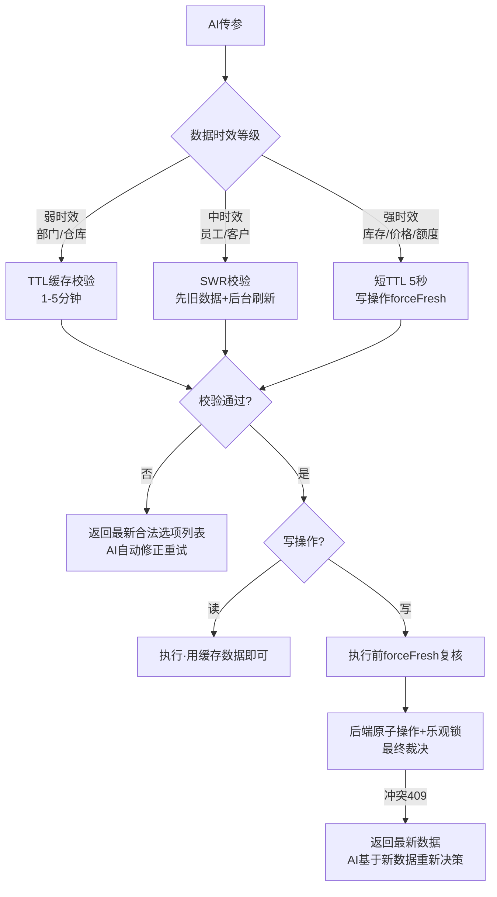

这是ERP集成Agent时非常典型的问题——**动态选项数据（库存状态、有效价格、在职人员、可用仓位等）有时效性，缓存太久会校验通过“过期数据”，不缓存又会让每次调用都打接口、太慢**。
核心思路是：**放弃“长期缓存”幻想，改用“短TTL + 合并请求 + 执行时复核”三件套**。下面展开。
---
## 🧠 一、先想清楚时效性数据校验的三个风险
| 风险 | 场景 | 后果 |
|------|------|------|
| **校验通过但数据已失效** | 校验时库存充足，建单时已被别人占用 | 单据创建成功但无法履约 |
| **无缓存导致接口风暴** | Agent一次任务调用10次工具，每次都查全量下拉数据 | 数据库压力大、响应慢 |
| **校验和执行之间有时间差** | 校验耗时500ms，期间数据变了 | 校验结论已过期 |
所以设计目标不是“校验绝对准确”，而是：**用最短窗口的新鲜数据校验 + 让不可靠的写操作在执行时被后端兜底拒绝**。
---
## ⚙️ 二、核心实现：带TTL的动态数据源解析器
写一个统一的 `DataSourceResolver`，所有动态下拉数据都走它，**绝不直接在工具里裸调接口**：
```javascript
// src/agent/data-source-resolver.js
class DataSourceResolver {
  /**
   * @param {Object} config
   * @param {Function} config.loader       真实数据加载函数 (session) => options[]
   * @param {number}   config.ttlMs        缓存存活时间，时效性强的设短一些
   * @param {number}   config.maxAge       超过此时间数据必须重新拉取（硬过期）
   * @param {string}   config.label        数据源名称（用于错误提示）
   * @param {boolean}  config.freshRequired 写操作场景是否要求强制新鲜数据
   */
  constructor({ loader, ttlMs = 30_000, maxAge = 60_000, label, freshRequired = false }) {
    this.loader = loader
    this.ttlMs = ttlMs
    this.maxAge = maxAge
    this.label = label
    this.freshRequired = freshRequired
    // 缓存按用户隔离！不同用户权限不同，选项列表不同
    this.cache = new Map()  // key: userId → { data, fetchedAt, promise }
  }
  /**
   * 获取选项数据（单飞模式：并发请求自动合并为一次真实调用）
   */
  async get(session, { forceFresh = false } = {}) {
    const key = session.userId
    const cached = this.cache.get(key)
    const now = Date.now()
    // ── 缓存命中判断 ──
    if (!forceFresh && cached?.data && now - cached.fetchedAt < this.ttlMs) {
      return cached.data
    }
    // ── 缓存过期但"尚可容忍"（stale-while-revalidate）──
    // 先返回旧数据让本次校验通过，同时后台刷新
    if (!forceFresh && !this.freshRequired && cached?.data && now - cached.fetchedAt < this.maxAge) {
      this.refreshInBackground(session, key)
      return cached.data
    }
    // ── 必须重新拉取：请求合并（单飞） ──
    // 如果已有进行中的请求，等它完成而不是再发一次
    if (cached?.promise) {
      return cached.promise
    }
    const promise = (async () => {
      try {
        const data = await this.loader(session)
        this.cache.set(key, { data, fetchedAt: Date.now() })
        return data
      } finally {
        // 请求完成后清除promise引用，允许下次重新拉取
        if (this.cache.get(key)?.promise) {
          const entry = this.cache.get(key)
          delete entry.promise
        }
      }
    })()
    this.cache.set(key, { ...this.cache.get(key), promise })
    return promise
  }
  refreshInBackground(session, key) {
    // 防止重复触发后台刷新
    if (this.cache.get(key)?.refreshing) return
    this.cache.get(key).refreshing = true
    this.loader(session)
      .then(data => this.cache.set(key, { data, fetchedAt: Date.now() }))
      .catch(() => { /* 刷新失败时保留旧数据，下次强制刷新 */ })
      .finally(() => { if (this.cache.get(key)) this.cache.get(key).refreshing = false })
  }
  /** 用户权限变更/登出时清缓存 */
  invalidate(userId) {
    if (userId) this.cache.delete(userId)
    else this.cache.clear()
  }
}
export const resolvers = new Map()
/** 注册一个动态数据源（全局单例） */
export function registerDataSource(name, config) {
  const r = new DataSourceResolver(config)
  resolvers.set(name, r)
  return r
}
export function getDataSource(name) {
  return resolvers.get(name)
}
```
### 关键设计点解释
1. **TTL 30秒 + 硬过期 60秒（stale-while-revalidate）**：
   - 30秒内直接用缓存（Agent多步任务中的连续校验不会重复打接口）
   - 30~60秒之间先返回旧数据、后台静默刷新（校验不阻塞，数据自动保鲜）
   - 超过60秒强制拉新
   
2. **单飞**：Agent一次任务并发调用5个工具，都需要查部门列表 → 只发1次真实请求，其余共享同一个Promise。
3. **按用户隔离缓存**：下拉选项通常带权限过滤，绝不能用全局缓存（A用户能看的仓库 ≠ B用户能看的仓库），同时登出时 `invalidate`。
---
## 🎯 三、按场景设置不同时效策略
不是所有动态数据时效性都一样，**分级设置**：
```javascript
// src/agent/data-sources.js —— 统一登记所有动态数据源
import { registerDataSource } from './data-source-resolver'
import { warehouseService, stockService, staffService, priceService } from '@/services'
// ── 弱时效（分钟级变化）：可用较长TTL ──
export const warehouseDS = registerDataSource('warehouse', {
  label: '仓库',
  ttlMs: 60_000,       // 1分钟
  maxAge: 300_000,     // 5分钟硬过期
  loader: (session) => warehouseService.getAuthorizedWarehouses(session.userId)
})
// ── 中时效（秒级~分钟级变化）──
export const staffDS = registerDataSource('staff', {
  label: '在职员工',
  ttlMs: 30_000,
  maxAge: 120_000,
  loader: (session) => staffService.getActiveStaff(session.orgId)
})
// ── 强时效（随时变化）：只做短TTL，且标记freshRequired ──
export const availableStockDS = registerDataSource('available_stock', {
  label: '可用库存',
  ttlMs: 5_000,          // 只有5秒！
  maxAge: 10_000,
  freshRequired: true,   // 写操作前强制拉最新
  loader: (session, params) => stockService.getAvailable(params.productId, params.warehouseId)
})
```
**分级原则**：
| 数据类型 | 变化频率 | TTL建议 | 校验策略 |
|---------|---------|---------|---------|
| 部门/仓库/币种 | 几乎不变 | 1~5分钟 | 缓存即可 |
| 在职员工/客户列表 | 小时级 | 30~60秒 | SWR即可 |
| **价格体系** | 随促销变动 | 10~30秒 | SWR + 执行时后端复核 |
| **可用库存/信用额度** | 实时 | 0~5秒 | 校验仅供参考，**以后端执行时判定为准** |
| 审批人/在途单据 | 实时 | 不缓存 | 每次强制拉取 |
---
## 🔀 四、处理“校验通过但执行时已失效”——快照+复核模式
这是时效性数据的**终极问题**。正确做法：**校验用缓存数据快速反馈，写操作执行时由后端用最新数据做最终裁决**，前端校验的定位是“提高首次成功率”，而不是“保证正确性”。
```javascript
// 工具定义：以"创建销售订单（涉及实时库存）"为例
export const createOrderTool = defineTool({
  name: 'create_sales_order',
  riskLevel: 'write',
  inputSchema: { /* ... 略 ... */ },
  rules: {
    byField: {
      warehouseId: [validators.validOptions(warehouseDS)],  // 弱时效：缓存校验即可
      salespersonId: [validators.validOptions(staffDS)],    // 中时效：SWR校验
    }
  },
  execute: async (params, session) => {
    // ── 写操作前：对强时效数据做"临执行强制刷新"校验 ──
    const stockDS = getDataSource('available_stock')
    for (const line of params.lines) {
      // forceFresh: 跳过缓存，此刻拉最新库存
      const stock = await stockDS.get(session, { forceFresh: true })
      const available = stock.find(s => s.productId === line.productId)
      if (!available || available.qty < line.quantity) {
        return {
          success: false,
          errorType: 'STOCK_CHANGED',
          reason: `商品${line.productId}当前可用库存${available?.qty ?? 0}，不足${line.quantity}`,
          // 给AI的备选方案提示
          suggestion: '可调用 query_alternative_warehouse 查询其他有货仓库，或减少数量后重试'
        }
      }
    }
    // ── 即使通过了上面的刷新校验，仍可能在校验后毫秒级窗口内被抢占 ──
    // 所以后端建单接口内部还要做占用校验（乐观锁/库存扣减原子操作）
    return await orderService.create(params)  // 后端是真正的最终裁决者
  }
})
```
**后端配套**（这一层不能省）：
```javascript
// 后端：库存扣减必须原子化，拒绝"校验通过但已失效"的请求
app.post('/api/sales-orders', async (req, res) => {
  // 在数据库事务中用条件更新实现乐观锁
  // UPDATE stock SET qty = qty - :n WHERE product_id = :p AND qty >= :n
  // 影响行数为0 → 说明库存已被抢占 → 返回409和最新库存
  const result = await db.transaction(async tx => {
    for (const line of req.body.lines) {
      const affected = await tx.stock.deductIfEnough(line)
      if (affected === 0) {
        throw new ConflictError({
          productId: line.productId,
          message: '库存已变化，请重新查询',
          currentStock: await tx.stock.get(line.productId)  // 顺便返回最新值
        })
      }
    }
    return tx.orders.create(req.body)
  })
  res.json(result)
})
```
前端工具拿到 `ConflictError` 后返回给AI：
```javascript
// axios拦截器中转换
if (err.response?.status === 409) {
  return {
    success: false,
    errorType: 'RACE_CONDITION',
    reason: err.response.data.message,
    latestData: err.response.data.currentStock,  // 把最新数据给AI
    hint: '数据刚刚发生变化，请基于latestData重新决策后重试'
  }
}
```
---
## 🔍 五、动态选项作为“提示”喂给AI的正确姿势
时效性数据还有一个特殊用途：**与其让AI先猜再校验再重试（浪费轮次），不如在校验失败时把新鲜选项直接给AI**。前面 `validOptions` 已实现这一点，但对时效性数据再加一层优化——**在错误提示中标注数据的获取时间**：
```javascript
// 增强版 validOptions：提示AI数据的新鲜度
validators.validOptionsWithFreshness = (dsResolver, labelField) => ({
  dynamic: true,
  validate: async (value, ctx) => {
    if (value == null) return
    const options = await dsResolver.get(ctx.session)
    const matched = options.find(o => o.id === value || o[labelField] === value)
    if (!matched) {
      const freshness = Math.round((Date.now() - dsResolver.cache.get(ctx.session.userId)?.fetchedAt) / 1000)
      return {
        message: `"${value}" 不在可选范围内`,
        llmHint: `合法选项(数据获取于${freshness}秒前): ${options.slice(0,15).map(o => `${o.id}(${o[labelField]})`).join('、')}。请从中选择；如果都不合适，可调用 search_${ctx.fieldName} 工具模糊搜索`
      }
    }
  }
})
```
标注新鲜度很有价值：当AI发现“这批可选库存是30秒前的”，它会对涉及强时效数据的操作主动调用 `forceFresh` 或先执行查询工具。
---
## 🧹 六、缓存生命周期管理（防止脏数据）
```javascript
// 全局事件驱动的缓存失效
export function setupCacheInvalidation() {
  // ① 登出/切换账号/切换租户 → 全部清空
  eventBus.on('auth:logout', () => resolvers.forEach(r => r.invalidate()))
  // ② 关键业务动作后精准失效
  //    例如：仓库主管修改了仓库权限 → 该用户下次必须拉新
  eventBus.on('warehouse:permission-changed', (userId) => {
    getDataSource('warehouse')?.invalidate(userId)
  })
  // ③ 单据状态变更 → 相关数据源失效
  //    例如：出入库完成 → 库存数据源全量失效
  eventBus.on('stock:movement-completed', () => {
    getDataSource('available_stock')?.invalidate()
  })
  // ④ 页面重新获得焦点时（用户切走又切回来，数据可能已陈旧）
  document.addEventListener('visibilitychange', () => {
    if (document.visibilityState === 'visible') {
      // 将所有缓存标记为需要刷新（下次访问时走SWR后台刷新）
      resolvers.forEach(r => r.markStale())
    }
  })
  // ⑤ 兜底：定时清理，防止内存泄漏（用户长时间不操作）
  setInterval(() => {
    resolvers.forEach(r => r.cleanup(10 * 60_000))  // 清理10分钟未访问的缓存
  }, 60_000)
}
```
---
## ✅ 七、总结：时效性数据校验的完整策略

**三条铁律**：
1. **缓存只服务读和预校验，不作为写操作的依据**——库存、价格、信用额度这类强时效数据，写操作前必须 forceFresh，且后端用原子操作做最终裁决
2. **校验失败的错误信息就是最好的“数据接口”**——把新鲜的合法选项列表直接喂给AI，一次修正到位
3. **校验通过 ≠ 执行成功**——从校验到执行之间的时间差永远存在，用乐观锁 + 结构化冲突响应（附最新数据）让AI能自愈
这样组合下来：普通场景AI首次调用成功率85%+，即使遇到数据竞争，AI也能在1-2次重试内自行解决，不会出现“拿着过期数据创建单据”的事故。
需要的话，我可以帮你写一个针对你们具体场景（比如“查库存→建单”链路）的完整可运行示例，包括前端resolver + 后端乐观锁的完整代码。
